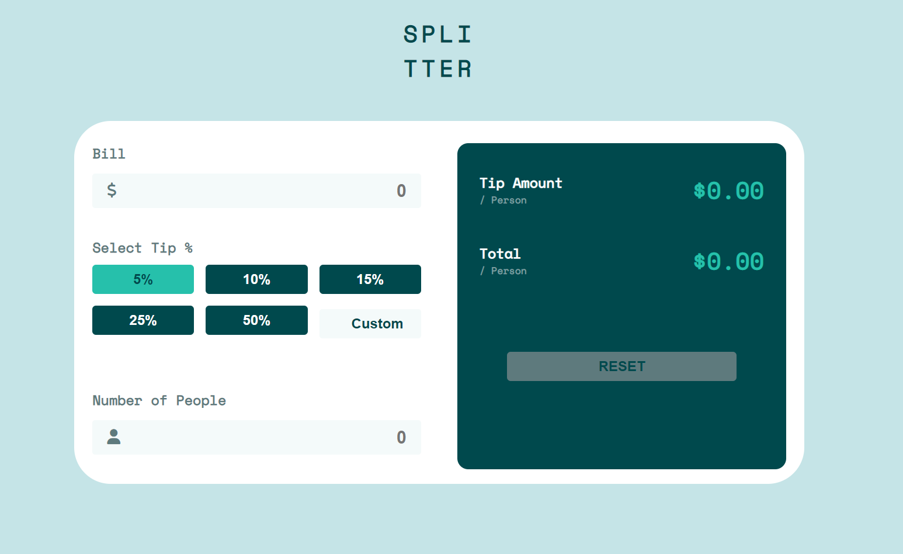

# Overview

## The challenge

Users should be able to:

* View the optimal layout for the app depending on their device's screen size
* See hover states for all interactive elements on the page
* Calculate the correct tip and total cost of the bill per person

## Screenshot

### Desktop

### Mobile

